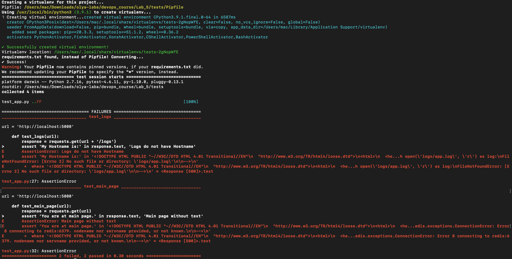
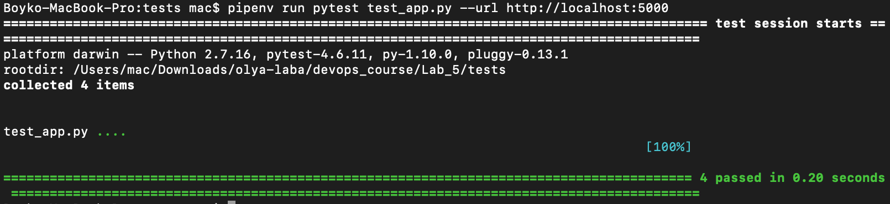
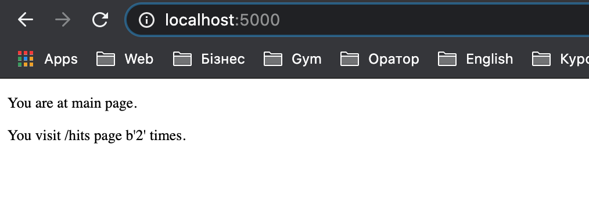
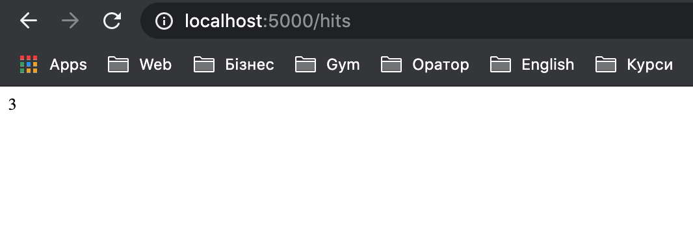
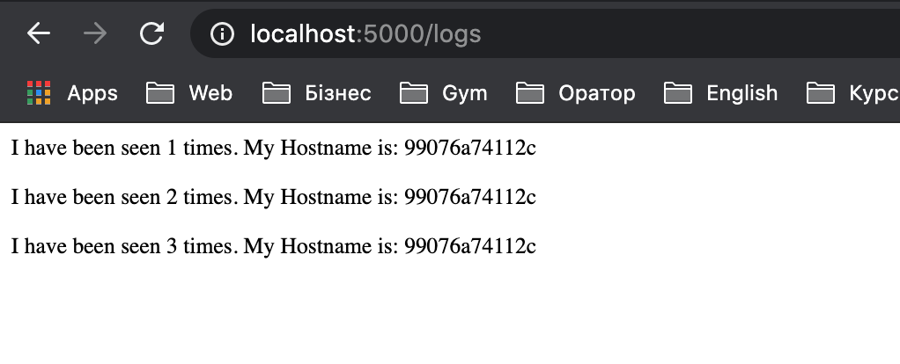

# Lab 5
## Хід роботи
1. Ознайомилась з docker-compose та документацією до нього;
2. Ознайомилась з бібліотекою Flask та документацією до неї;
3. Створила папку ```my_app``` в якій буде знаходитись мій проект. Створила папку ```tests``` де будуть тести на перевірку працездатності мого проекту. Скопіювала файли із зазначеного репозиторію у відповідні папки мого проекту. Ознайомилась із вмістом кожного з файлів. У файлі ```requirements.txt``` вказуються бібліоткеки Python, які будуть викоритовуватись в цьому додатку.
4. Виконала наступні команди та перевірила працездатність проекту:
    
        pipenv --python 3.7
        pipenv install -r requirements.txt
        pipenv run python app.py
        ---------------------------------------------------------------------------
        MacBook-Pro:my_app mac$ pipenv --python 3.7
        Creating a virtualenv for this project...
        Pipfile: /Users/mac/Downloads/olya-laba/devops_course/Lab_5/my_app/Pipfile
        Using /usr/bin/python3 (3.7.3) to create virtualenv...
        ⠧ Creating virtual environment...created virtual environment CPython3.7.3.final.0-64 in 3354ms
        creator CPython3macOsFramework(dest=/Users/mac/.local/share/virtualenvs/my_app-hmqzatg5, clear=False, no_vcs_ignore=False, global=False)
        seeder FromAppData(download=False, pip=bundle, wheel=bundle, setuptools=bundle, via=copy, app_data_dir=/Users/mac/Library/Application Support/virtualenv)
            added seed packages: pip==20.3.3, setuptools==51.1.2, wheel==0.36.2
        activators PythonActivator,FishActivator,XonshActivator,CShellActivator,PowerShellActivator,BashActivator

        ✔ Successfully created virtual environment! 
        Virtualenv location: /Users/mac/.local/share/virtualenvs/my_app-hmqzatg5
        requirements.txt found, instead of Pipfile! Converting...
        ✔ Success!

        ---------------------------------------------------------------------------

        MacBook-Pro:my_app mac$ pipenv install -r requirements.txt
        Requirements file provided! Importing into Pipfile...
        Pipfile.lock not found, creating...
        Locking [dev-packages] dependencies...
        Locking [packages] dependencies...
        Building requirements...
        Resolving dependencies...
        ✔ Success! 
        Updated Pipfile.lock (7f6126)!
        Installing dependencies from Pipfile.lock (7f6126)...
        🐍   ▉▉▉▉▉▉▉▉▉▉▉▉▉▉▉▉▉▉▉▉▉▉▉▉▉▉▉▉▉▉▉▉ 7/7 — 00:00:02
        To activate this project's virtualenv, run pipenv shell.
        Alternatively, run a command inside the virtualenv with pipenv run.

        ---------------------------------------------------------------------------

        MacBook-Pro:my_app mac$ pipenv run python app.py
        * Serving Flask app "app" (lazy loading)
        * Environment: production
        WARNING: This is a development server. Do not use it in a production deployment.
        Use a production WSGI server instead.
        * Debug mode: on
        * Running on http://0.0.0.0:5000/ (Press CTRL+C to quit)
        * Restarting with stat
        * Debugger is active!
        * Debugger PIN: 405-585-571

5. Ініціалізувала середовище для тестів у іншій вкладці шелу та запустила командою
        
        pipenv run pytest test_app.py --url http://localhost:5000
    
    2 тести провалені
    
    
    Ця проблема спричинена тим, що на локальній машині має бути запущений сервер Redis. І ще в мому випадку host повинен бути localhost замість redis. Після виправлення усіх неполадок усе запрацювало як має бути.

    

6. Видалила файли які були створені після тестового запуску. Створила два Dockerfile з іменами як у цьому репозиторії та Makefile який допоможе автоматизувати процес розгортання.
7. Ознайомилась із вмістом Makefile та його директивами:
        
   * app - запускає зборку ```docker``` для ```Dockerfile.app``` та білдить контейнер додатку.
   * tests - запускає зборку ```docker``` для ```Dockerfile.tests``` та білдить контейнер для тестування додатку.
   * run - створює ```docker container network```, запускає контейнер ```Redis```, запускає контейнер ```app```.
   * test-app - запускає контейнер для тестування додатку.
   * docker-prune - очищає усі невикористовувані контейнери, з'єднання, волюми та імеджі.
8. Використовуючи команду make створила Docker імеджі для додатку та для тестів. Запустила додаток та перейшовши в іншу вкладку шелу запустила тести. Переконався що тести пройшли успішно.
        
        MacBook-Pro:Lab_5 mac$ make run
        e5d0d76da7d2363e61ca252e2385a865a82cd5796052978ff6811dcb88cca313
        Unable to find image 'redis:latest' locally
        latest: Pulling from library/redis
        a076a628af6f: Already exists 
        f40dd07fe7be: Pull complete 
        ce21c8a3dbee: Pull complete 
        ee99c35818f8: Pull complete 
        56b9a72e68ff: Pull complete 
        3f703e7f380f: Pull complete 
        Digest: sha256:0f97c1c9daf5b69b93390ccbe8d3e2971617ec4801fd0882c72bf7cad3a13494
        Status: Downloaded newer image for redis:latest
        74647a298bc20160ceb68c12cd5e55ee1159fc37cee4ac0ad963fe9577a2ecf6
        99076a74112c214dd6e14ee0a5ab43143000e6b7eb8926b3c8c43da2a01f324c

        ---------------------------------------------------------------------

        MacBook-Pro:Lab_5 mac$ make test-app
        Warning: Your Pipfile requires python_version 3.9, but you are using 3.7.9 (/root/.local/share/v/t/bin/python).
          $ pipenv --rm and rebuilding the virtual environment may resolve the issue.
          $ pipenv check will surely fail.
        ============================================== test session starts ===============================================
        platform linux -- Python 3.7.9, pytest-6.2.1, py-1.10.0, pluggy-0.13.1
        rootdir: /tests
        collected 4 items                                                                                                

        test_app.py ....                                                                                           [100%]

        =============================================== 4 passed in 0.12s ================================================

9. Скріншоти роботи сторінок:



10. Очистила усе за допомогою директиви make docker-prune
11. Створила директиву ```push``` та завантажила  імеджі до свого репозиторію
        
        push:
             @$(foreach state,$(STATES), docker push $(REPO):$(state);)
12. Створила директиву ```delete-images``` та видалила усі імеджі з локальної машини:
        
        delete-images:
           @sudo docker image rm --force $(shell docker images -q)

        ---------------------------------------------------------------------------------------------------

        MacBook-Pro:Lab_5 mac$ docker images
        REPOSITORY         TAG       IMAGE ID       CREATED          SIZE
        olyavalchak/lab5   app       037cd231d635   8 minutes ago    129MB
        olyavalchak/lab5   tests     41a1691353f1   35 minutes ago   133MB
        redis              latest    621ceef7494a   3 days ago       104MB

        ---------------------------------------------------------------------------------------------------

        MacBook-Pro:Lab_5 mac$ docker images
        REPOSITORY         TAG       IMAGE ID       CREATED          SIZE
13. Перейшла до іншого варіанту з використанням ```docker-compose.yml```. Для цього створила даний файл у кореневій папці проекту та заповнила вмістом з прикладу. У нас будуть дві мережі:
    * Перша публічна для зв'язку з нашим сайтом
    * Друга закрита (secret) для зв'язку з ```redis```
14. Запустила ```docker-compose```:
        
        docker-compose -p lab5 up
15. Перевірила чи працює веб-сайт. Потрібно зайти на адресу 127.0.0.1:80.
16. Перевірила чи ```docker-compose``` створив потрібні імеджі на локальній машині:
        
        MacBook-Pro:Lab_5 mac$ docker images
        REPOSITORY         TAG             IMAGE ID       CREATED              SIZE
        olyavalchak/lab5   compose-tests   8b727f8f38dd   36 seconds ago       133MB
        olyavalchak/lab5   compose-app     cc8a852a97ef   About a minute ago   129MB
        redis              alpine          933c79ea2511   3 days ago           31.6MB
        python             3.7-alpine      72e4ef8abf8e   4 weeks ago          41.1MB
17. Зупинила проект та очистила усі ресурси через ```docker-compose down```:
        
        MacBook-Pro:Lab_5 mac$ docker-compose down
        Removing tests ... done
        Removing app   ... done
        Removing redis ... done
        Removing network lab5_secret
        Removing network lab5_public
18. Завантажила створені імеджі до Docker Hub репозиторію за допомого команди:
        
        docker-compose push
19. Makefile є незручним у використанні через те, що потрібно прописувати дуже велику кількість директив вручну для установки імеджів та запуску контейнерів. У випадку з docker-compose усе можна зробити однією командою без лишніх кроків.
20. Створила ```docker-compose``` для лабораторної роботи №4 та завантажила файл ```docker-compose.yml``` до репозиторію 4 лабораторної роботи. Після запуску усе успішно запрацювало.
